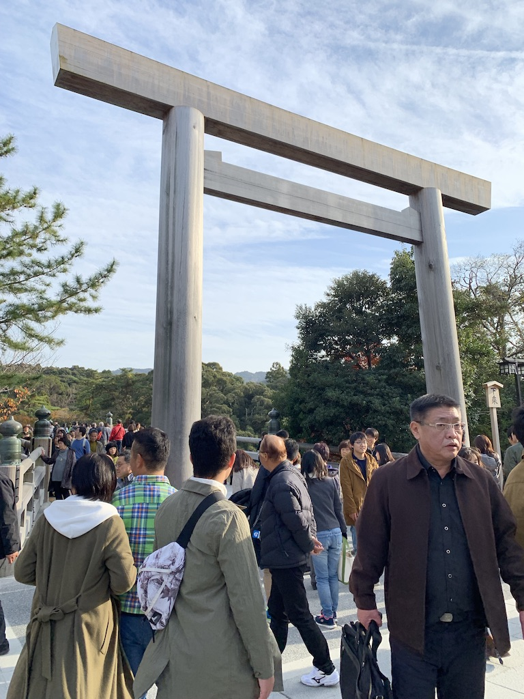
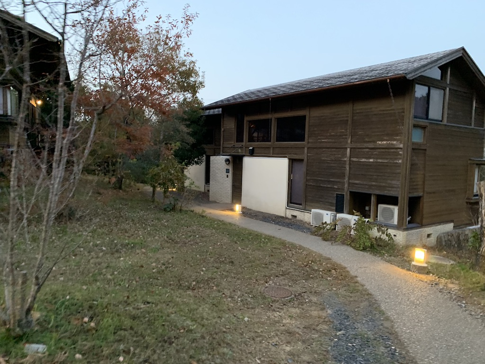

お伊勢参り
=====

実はこの週末は伊勢神宮にお参りに行っていました。

とはいえ僕以外の参加者は学生で、完全に学生旅行のノリで行ったので計画とかルートとか適当です。事前の下調べとかもなかったのでまずは外宮(げくう)に参拝するとかの作法をガン無視して内宮(ないくう)に行きました。

> 友人「この外宮(がいぐう)ってところからお参りするのが作法らしい」
>
> 僕「Google先生によると外宮(げぐう)って読むらしいぞ」
>
> 看板 [外宮(GEKU)]
>
> 友人「げくうって書いてあるけど」
>
> 僕「あの看板の濁点消えちゃったんじゃないですか？」

参道の様子。左右にはお土産やさんや伊勢うどんのお店、赤福のお店などが並んでいます。

入り口の鳥居。Google Mapで見て知ったのですが「宇治橋鳥居」という名前が付いているそうですね。

正宮の様子。ここより先は撮影禁止です。

帰る途中で木に何かついているのを発見。農学部の友人が言うにはヤドリギだそうです。

宿は「ホテル近鉄アクアヴィラ伊勢志摩」です。流石に冬は人気がないのか、コテージが安かったのでここにしました。

2日目は横山展望台に行きました。日曜の午前中だけあってかなり混んでいます。

横山展望台のテラスを進んでいくとパノラマ展望台や見晴展望台などがあります。事実上の山登りだったので運動不足の体が悲鳴をあげていました。

展望台を移動しても見える景色は変わりませんでしたけどね。

----
旅行のことを親に話して判明したのですが、僕は小学6年生のとき伊勢参りに行っていたそうです。俗に言う家族旅行ってやつです。

全然記憶になかったので「へ〜」って感じだったんですが、父親が当時のブログを出してきてくれました。そこで初めて父親がブログをやっていたことを知ったんですが、めっちゃどうでもいいようなことでも後から読むと面白いんですね。

そういう訳で将来の自分のために日記を書くことにしました。